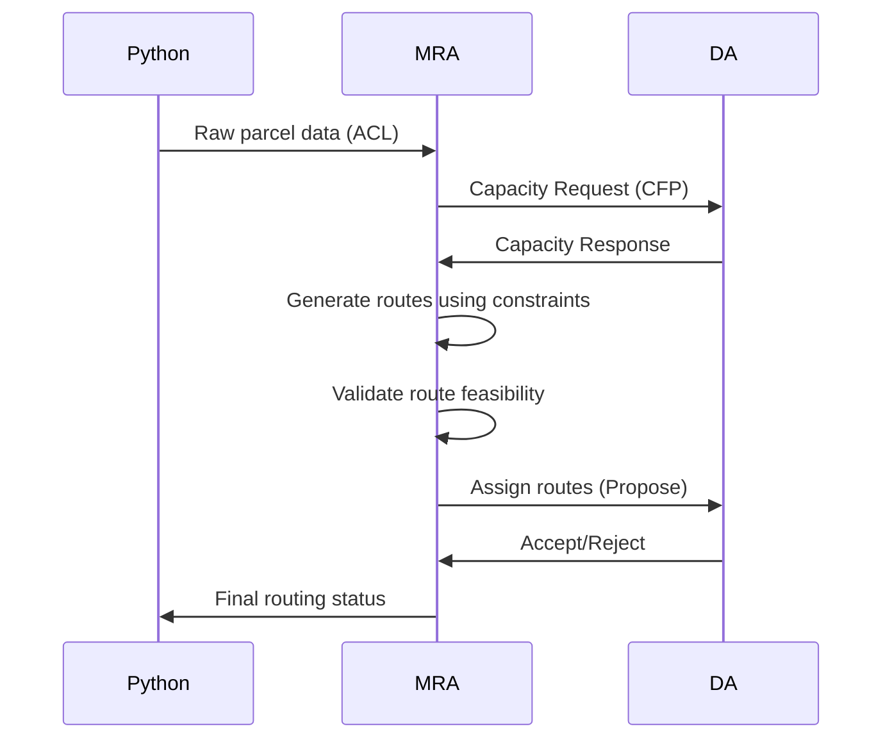

**Architectural Requirements**
1. ✅ Send individual routes to delivery agents
2. ❌ Collect capacity constraints from DAs (static config only) 
3. ❌ Receive parcel list directly (indirect via Python)
4. ❌ Validate routes against constraints (no verification)

**Implementation Gaps**

CRITERIA                            CURRENT IMPLEMENTATION              REQUIRED CHANGES
─────────────────────────────────── ─────────────────────────────────── ────────────────────────────────────────────────
Collect capacity constraints        No capacity collection mechanism    Add FIPA request protocol in MRA to query DAs
from delivery agents

Receive parcel list directly        Parcels come via Python optimization Remove Python dependency, read parcels from
                                    results                              config arguments

Produce routes internally           Delegates to external Python         Implement routing algorithm in MRA using
                                    optimization                         collected constraints

Send individual routes              Routes come pre-generated from       Generate and dispatch routes within MRA based
                                    Python                               on actual capacities

**Acceptance Criteria**
- [ ] Implement FIPA request protocol for DA capacity collection
- [ ] Read parcel list directly from configuration arguments
- [ ] Develop internal routing algorithm in MRA
- [ ] Generate and dispatch routes based on live DA capacities
- [ ] Remove Python optimization dependency from routing

**Technical Specifications**

**Required File Modifications**
1. `MasterRoutingAgent.java` - Core routing logic
2. `DeliveryAgent.java` - Capacity reporting
3. `py4j_gateway.py` - Update data flow protocol

**Migration Risks**
- Requires parallel run of old/new systems during transition
- Needs updated integration tests
- May break existing Python optimization UI
