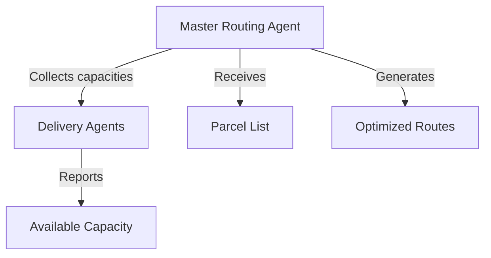

**Current Shortcomings**
1. ❌ MRA delegates route generation to Python without considering real-time DA capacities
2. ❌ Capacity constraints not collected from Delivery Agents (DAs)
3. ❌ Parcel list handling indirect through Python results
4. ❌ Route optimization occurs externally rather than in JADE

**Code Evidence**
```java
// MasterRoutingAgent.java (partial)
JSONObject resultsObject = new JSONObject(fullResultsJson);
JSONArray optimisedRoutes = resultsObject.getJSONArray("optimised_routes");
// Simply forwards pre-computed routes without capacity checks
```

**Proposed Changes**
1. Add DA capacity reporting protocol
2. Implement internal constraint-based routing in MRA
3. Direct parcel list handling in MRA
4. Move optimization logic from Python to JADE

**Affected Components**
1. `packages/execution/backend/java/scr/MasterRoutingAgent.java`
2. `packages/execution/backend/java/scr/DeliveryAgent.java`
3. `packages/execution/backend/py4j_gateway.py`

**Acceptance Criteria**
- [ ] MRA actively collects capacity updates from DAs via ACL messages
- [ ] Route generation considers real-time capacity constraints
- [ ] Parcel list received directly via MRA messages
- [ ] Python optimization logic moved to JADE
- [ ] Unit tests for capacity validation
- [ ] Integration tests for full routing workflow

**Implementation Steps**
1. Add capacity reporting behavior to DeliveryAgent
2. Implement FIPA-Request protocol in MRA for capacity collection
3. Create constraint-based routing algorithm in MRA
4. Remove Python optimization dependency
5. Update gateway methods for new data flow

**Related Components**

