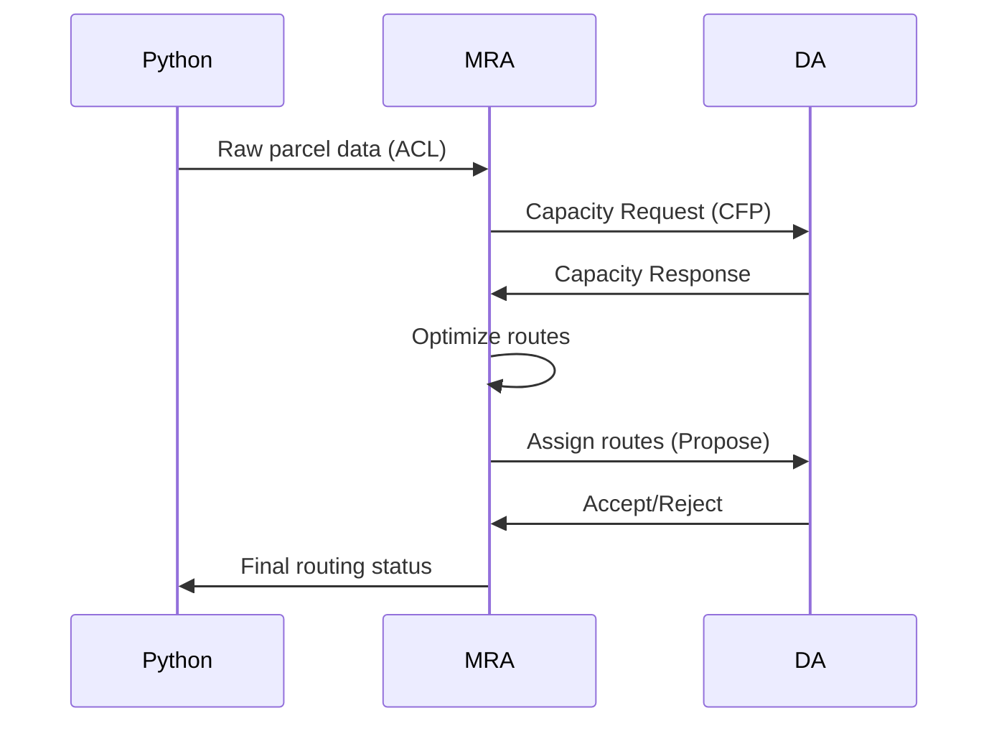

**Architectural Requirements**
1. ✅ Send individual routes to delivery agents
2. ❌ Collect capacity constraints from DAs (static config only)
3. ❌ Receive parcel list directly (indirect via Python)
4. ❌ Produce routes internally (external Python dependency)

**Implementation Gaps**

| Component              | Current State               | Required State                |
|------------------------|-----------------------------|-------------------------------|
| Capacity Collection    | Static configuration values | Dynamic DA messaging protocol | 
| Parcel Handling         | Indirect Python results     | Direct ACL message ingestion  |
| Route Generation        | Python optimization         | Internal constraint solver    |
| Constraint Validation   | None                        | Pre-routing verification      |

**Acceptance Criteria**
- [ ] Implement FIPA Subscribe protocol for DA capacity updates
- [ ] Add parcel ingestion via JADE Agent Communication
- [ ] Develop internal routing algorithm with capacity constraints
- [ ] Remove external Python optimization dependency
- [ ] Add validation framework for route feasibility

**Technical Specifications**

**Required File Modifications**
1. `MasterRoutingAgent.java` - Core routing logic
2. `DeliveryAgent.java` - Capacity reporting
3. `py4j_gateway.py` - Update data flow protocol

**Migration Risks**
- Requires parallel run of old/new systems during transition
- Needs updated integration tests
- May break existing Python optimization UI
