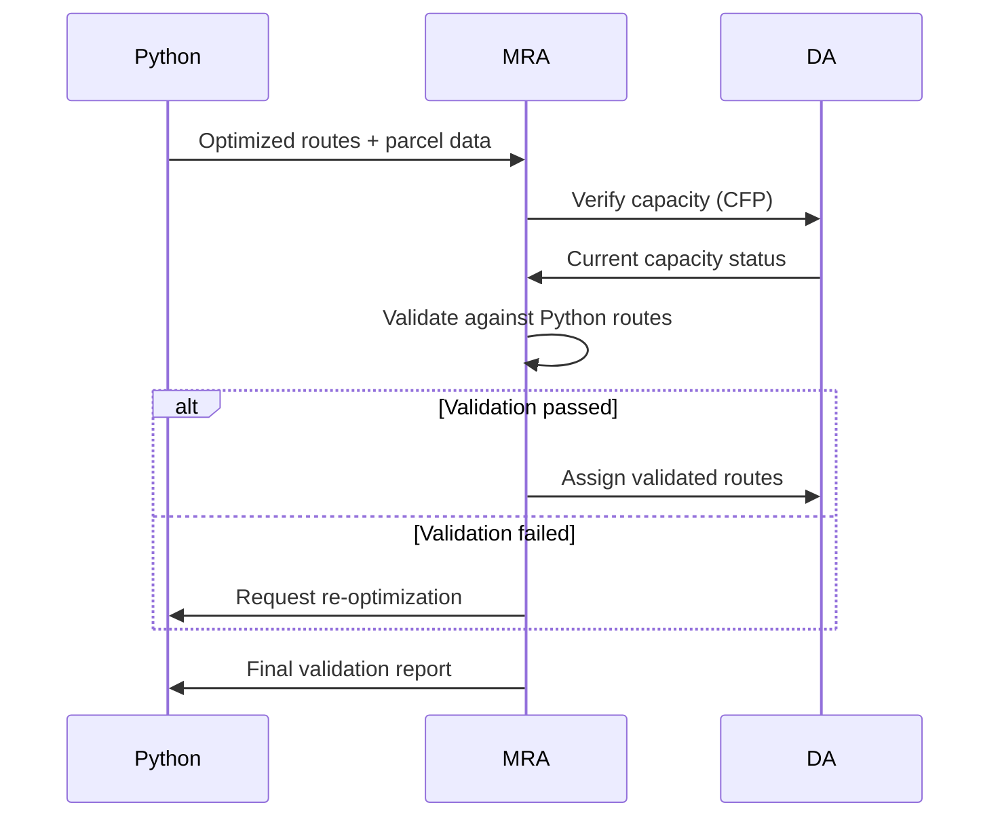

**Architectural Requirements**
1. ✅ Send individual routes to delivery agents
2. ⚠️ Collect capacity constraints from DAs (static config only) 
3. ⚠️ Receive parcel list (via Python optimization results)
4. ⚠️ Validate routes against static config constraints

**Implementation Gaps**

CRITERIA                            CURRENT IMPLEMENTATION              REQUIRED CHANGES
─────────────────────────────────── ─────────────────────────────────── ────────────────────────────────────────────────
Collect capacity constraints        Static config via Python            Add live capacity updates from DAs while
from delivery agents                                                    maintaining Python integration

Receive parcel list                 Via Python optimization results     Add direct config loading as fallback

Validate route feasibility          Basic static config validation      Add real-time capacity verification against
                                                                        live DA status

Route optimization core             Python-generated routes             Add MRA-side validation layer for Python
                                                                        optimization output

**Acceptance Criteria**
- [x] Maintain Python optimization integration
- [ ] Add DA capacity heartbeat updates
- [ ] Implement hybrid validation (static config + live DA status)
- [ ] Add fallback config parcel loading
- [ ] Create validation report format for Python optimization

**Technical Specifications**

**Required File Modifications**
1. `MasterRoutingAgent.java` - Core routing logic
2. `DeliveryAgent.java` - Capacity reporting
3. `py4j_gateway.py` - Update data flow protocol

**Migration Risks**
- Requires parallel run of old/new systems during transition
- Needs updated integration tests
- Requires Python optimization to include capacity metadata
- Needs enhanced error handling for invalid routes
