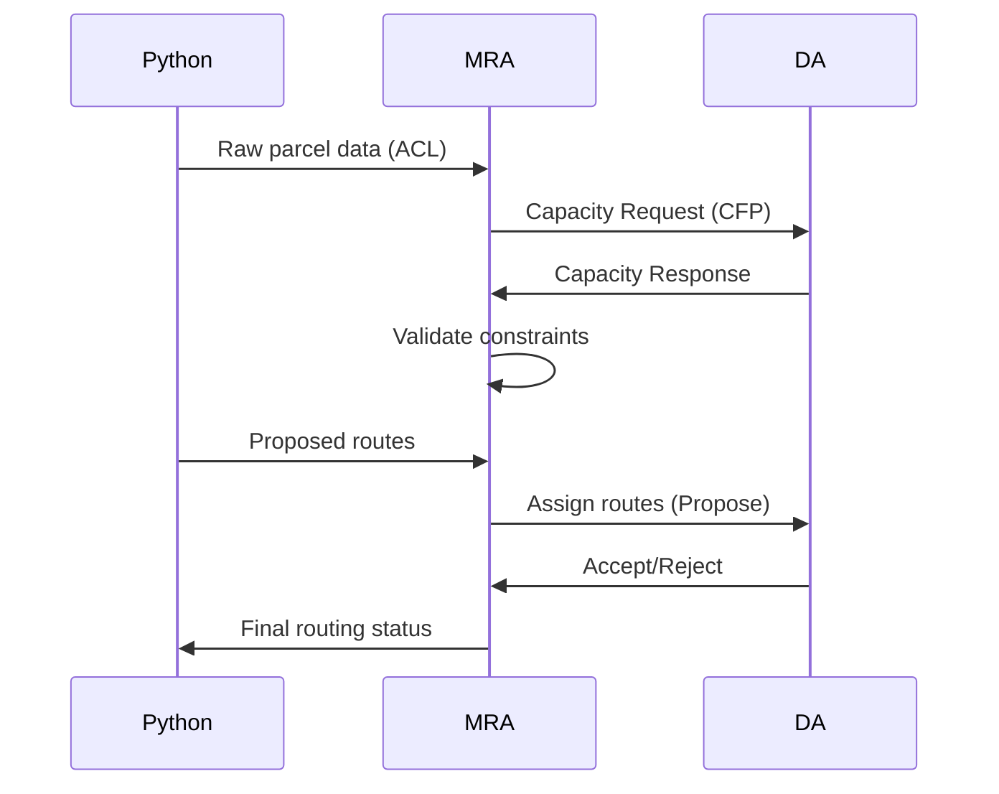

**Architectural Requirements**
1. ✅ Send individual routes to delivery agents
2. ❌ Collect capacity constraints from DAs (static config only) 
3. ❌ Receive parcel list directly (indirect via Python)
4. ❌ Validate routes against constraints (no verification)

**Implementation Gaps**

| Component              | Current State               | Required State                |
|------------------------|-----------------------------|-------------------------------|
| Capacity Collection    | Static configuration values | Dynamic DA capacity updates   |
| Parcel Handling         | Indirect Python results     | Direct agent communication    | 
| Route Validation        | None                        | Pre-dispatch verification     |
| DA Status Tracking      | None                        | Real-time capacity monitoring |

**Acceptance Criteria**
- [ ] Implement FIPA Subscribe protocol for DA capacity updates
- [ ] Add parcel ingestion via JADE Agent Communication  
- [ ] Add validation framework for Python-generated routes
- [ ] Maintain real-time DA capacity status tracking
- [ ] Implement route verification pre-dispatch checks

**Technical Specifications**

**Required File Modifications**
1. `MasterRoutingAgent.java` - Core routing logic
2. `DeliveryAgent.java` - Capacity reporting
3. `py4j_gateway.py` - Update data flow protocol

**Migration Risks**
- Requires parallel run of old/new systems during transition
- Needs updated integration tests
- May break existing Python optimization UI
