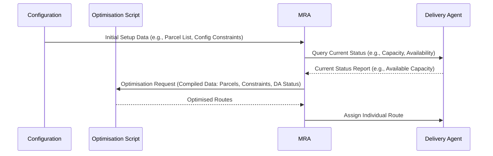

# Delivery Vehicle Routing System (DVRS)  маршруты

[](https://www.gnu.org/licenses/agpl-3.0)
[](https://www.python.org/downloads/)
[](https://streamlit.io)
[](http://jade.tilab.com/)
[]()

The Delivery Vehicle Routing System (DVRS) is a Streamlit-based application designed to manage, optimise, execute, and visualise delivery routes using a multi-agent system built with JADE (Java Agent DEvelopment Framework). It allows users to define delivery scenarios, apply custom optimisation algorithms, simulate the delivery process with JADE agents, and view the resulting routes graphically.

---

## Table of Contents

* [Features](#-features)
* [Core Technologies](#️-core-technologies)
* [Getting Started](#-getting-started)
    * [Prerequisites](#prerequisites)
    * [Running the Application](#running-the-application)
* [How it Works (High-Level Flow)](#️-how-it-works-high-level-flow)
* [Key Components](#-key-components)
* [Contributing](#-contributing)
* [License](#-license)
* [Author & Citation](#-author--citation)

---

## Features

* **Configuration Management:**
    * Create, load, edit, and save delivery configurations (warehouse location, parcels, delivery agents) in JSON format.
    * Intuitive UI for managing entities (parcels, agents) and their properties.
* **Pluggable Optimisation:**
    * Upload custom Python scripts to define optimisation logic.
    * Dynamically extracts and presents script parameters for user configuration.
    * Execute optimisation scripts to generate delivery routes based on the current configuration and parameters.
* **JADE Agent-Based Execution:**
    * Automatically compiles Java-based JADE agents.
    * Manages the JADE platform lifecycle (start/stop).
    * Creates and manages a `MasterRoutingAgent` (MRA) and multiple `DeliveryAgent` (DA) instances based on the configuration.
    * Communicates optimisation results from Python to the MRA in JADE via Py4J.
    * MRA dispatches individual routes to respective DAs.
    * DAs simulate route execution and send completion confirmations.
* **Real-time Logging:**
    * Displays logs from the JADE platform and agent communications within the UI.
* **Route Visualisation:**
    * Presents the optimised routes graphically, showing the warehouse, parcel locations, and agent paths.
* **Customisable UI:**
    * Built with Streamlit, providing an interactive web interface.
    * Includes options to toggle UI elements like the Streamlit header.

---

## Core Technologies

* **Python:**
    * **Streamlit:** For the web application user interface.
    * **Py4J:** To integrate Python with the Java-based JADE platform.
    * **Matplotlib:** For generating route visualisations.
* **Java:**
    * **JADE (Java Agent DEvelopment Framework):** For creating the multi-agent system that simulates deliveries.
* **JSON:** For configuration files and data exchange between Python and JADE.

---

## Getting Started

### Prerequisites

* Python 3.x (with `pip` for package management).
* Java Development Kit (JDK) - Ensure `java` and `javac` are in your system's PATH.
* Necessary Python packages (typically `streamlit`, `py4j`, `matplotlib`). You might want to create a `requirements.txt`:
    ```bash
    pip install streamlit py4j matplotlib
    ```

### Running the Application

1.  **Clone the repository** (if you haven't already):
    ```bash
    git clone [your-repository-url]
    cd [repository-name]
    ```
2.  **Ensure Dependencies are in Place:**
    * JADE library (`jade.jar`): `dependencies/java/JADE-all-4.6.0/jade/lib/jade.jar`
    * Py4J Java library (`py4jX.X.X.jar`): `dependencies/python/py4j-0.10.9.9/py4j-java/py4j0.10.9.9.jar`
    * `org.json.jar` library: `dependencies/java/libs/json-20250107.jar`
    * Custom JADE agent source files (`.java`): `packages/execution/backend/java/scr/` (compiled automatically).
3.  **Install Python packages** (if you have a `requirements.txt`):
    ```bash
    pip install -r requirements.txt
    ```
4.  **Navigate to the root directory** of the project.
5.  **Run the Streamlit application:**
    ```bash
    streamlit run dvrs.py
    ```
    The application should open in your default web browser.

---

## How it Works (High-Level Flow)

1.  **Configuration:** Load/create a JSON configuration (warehouse, parcels, delivery agents).
2.  **Optimisation Script:** Upload a Python script with `get_params_schema()` and `run_optimisation()`.
3.  **Parameter Setup:** Adjust script parameters via the UI.
4.  **Run Optimisation:** Python backend executes the script to generate routes.
5.  **JADE Platform Startup:**
    * Java agents in `packages/execution/backend/java/scr/` are compiled.
    * JADE platform starts with `Py4jGatewayAgent` (includes Py4J GatewayServer).
6.  **Agent Creation:** Python, via Py4J, instructs `Py4jGatewayAgent` to create MRA & DAs.
7.  **➡Dispatching Routes:** Python sends optimised routes (JSON) to `Py4jGatewayAgent` → MRA (JADE ACL message "FullVRPResults"). MRA parses and sends individual routes to DAs (JADE ACL message "VRPAssignment").
8.  **Route Simulation:** DAs simulate deliveries and send confirmations to MRA ("DeliveryConfirmation").
9.  **Feedback & Logging:** MRA relays DA confirmations (e.g., to `Py4jGatewayAgent` for UI logging). JADE STDOUT/STDERR are displayed.
10. **Visualisation:** Results are plotted using Matplotlib in the "Visualisation" tab.



---

## Key Components

* **`dvrs.py`:** Main Streamlit application entry point.
* **`packages/configuration/`**: Configuration management.
    * `config_logic.py`, `file_operations.py`
* **`packages/optimisation/`**: Optimisation script handling.
    * `optimisation_logic.py`, `script_lifecycle.py`
* **`packages/execution/`**: JADE platform and agent logic.
    * `execution_logic.py`, `jade_controller.py`, `java_compiler.py`, `py4j_gateway.py`
    * `java/scr/Py4jGatewayAgent.java`, `MasterRoutingAgent.java`, `DeliveryAgent.java`
* **`packages/visualisation/`**: Route visualisation UI.
* **`pnp/`**: Demo files (`demo-config.json`, `demo-optimiser.py`).

---

## Contributing

Contributions are welcome! Please feel free to submit pull requests or open issues.

---

## License

This project is licensed under the **GNU Affero General Public License v3.0**.
See the [LICENSE](LICENSE) file for full details.
Copyright (C) 2024-2025 [darklorddad](https://github.com/darklorddad).

[](https://www.gnu.org/licenses/agpl-3.0)

---

## Author & Citation

This Delivery Vehicle Routing System (DVRS) was principally developed by:

* **[darklorddad](https://github.com/darklorddad)**
* **[Crazyfier](https://github.com/Crazyfier)**
* **[TheDestor](https://github.com/TheDestor)**
* **[Basilagas21](https://github.com/Basilagas21)**
* **[AlishaMR-123](https://github.com/AlishaMR-123)**

If you use this software in your research, projects or work, we would appreciate it if you could cite it.
